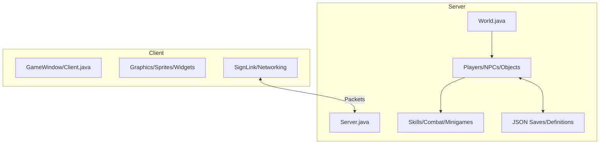

# Aeternal Project Map

This document provides a high-level overview of the Aeternal project structure, detailing where key features are implemented and how data flows through the system.

## 🏗️ High-Level Architecture

---

## 💾 Account & Character Data

| Feature | Description | Location |
| :--- | :--- | :--- |
| **Character Saves** | JSON files containing player progress, rights, and items. | [server/data/saves/characters/](file:///C:/Users/xandr/Documents/GitHub/Aeternal/server/data/saves/characters/) |
| **Persistence Logic** | How the server reads/writes character files. | [JSONFilePlayerPersistence.java](file:///C:/Users/xandr/Documents/GitHub/Aeternal/server/game/src/main/java/com/elvarg/game/entity/impl/player/persistence/jsonfile/JSONFilePlayerPersistence.java) |
| **Player Model** | The internal representation of a logged-in player. | [Player.java](file:///C:/Users/xandr/Documents/GitHub/Aeternal/server/game/src/main/java/com/elvarg/game/entity/impl/player/Player.java) |
| **Player Rights** | Enum defining MOD, ADMIN, OWNER, etc. | [PlayerRights.java](file:///C:/Users/xandr/Documents/GitHub/Aeternal/server/game/src/main/java/com/elvarg/game/model/rights/PlayerRights.java) |

---

## ⚔️ Combat & Item Effects

| Feature | Description | Location |
| :--- | :--- | :--- |
| **Combat Core** | Damage calculation, accuracy, and combat states. | [server/game/src/main/java/com/elvarg/game/content/combat/](file:///C:/Users/xandr/Documents/GitHub/Aeternal/server/game/src/main/java/com/elvarg/game/content/combat/) |
| **Food & Potions** | Logic for consuming items and their effects (healing, stat boosts). | [Food.java](file:///C:/Users/xandr/Documents/GitHub/Aeternal/server/game/src/main/java/com/elvarg/game/content/Food.java), [PotionConsumable.java](file:///C:/Users/xandr/Documents/GitHub/Aeternal/server/game/src/main/java/com/elvarg/game/content/PotionConsumable.java) |
| **Item Definitions** | Stats and properties for all items (loaded from JSON). | [server/data/definitions/items.json](file:///C:/Users/xandr/Documents/GitHub/Aeternal/server/data/definitions/items.json) |
| **Special Attacks** | Logic for weapon-specific special attacks. | [SpecialAttack.java](file:///C:/Users/xandr/Documents/GitHub/Aeternal/server/game/src/main/java/com/elvarg/game/content/combat/SpecialAttack.java) |

---

## 🏃 Skills

Skills are split between definitions and implementation logic.

- **Skill Manager**: Tracks XP, levels, and skill-related events.
    - [SkillManager.java](file:///C:/Users/xandr/Documents/GitHub/Aeternal/server/game/src/main/java/com/elvarg/game/content/skill/SkillManager.java)
- **Implementations**: Specific logic for each skill.
    - [server/game/src/main/java/com/elvarg/game/content/skill/skillable/impl/](file:///C:/Users/xandr/Documents/GitHub/Aeternal/server/game/src/main/java/com/elvarg/game/content/skill/skillable/impl/)
    - Examples: `Mining.java`, `Woodcutting.java`, `Runecrafting.java`.

---

## 🛠️ Server Management

| Feature | Description | Location |
| :--- | :--- | :--- |
| **In-Game Commands** | Developer and staff commands (::item, ::tele, etc.). | [server/game/src/main/java/com/elvarg/game/model/commands/impl/](file:///C:/Users/xandr/Documents/GitHub/Aeternal/server/game/src/main/java/com/elvarg/game/model/commands/impl/) |
| **World Logic** | Management of all active players, NPCs, and Ground items. | [World.java](file:///C:/Users/xandr/Documents/GitHub/Aeternal/server/game/src/main/java/com/elvarg/game/World.java) |
| **Networking** | Handles incoming packet data from clients. | [server/game/src/main/java/com/elvarg/net/](file:///C:/Users/xandr/Documents/GitHub/Aeternal/server/game/src/main/java/com/elvarg/net/) |

---

## 🖼️ Client (Visuals & Interface)

| Feature | Description | Location |
| :--- | :--- | :--- |
| **Main Loop** | The core rendering and input processing loop. | [Client.java](file:///C:/Users/xandr/Documents/GitHub/Aeternal/client/src/main/java/com/runescape/Client.java) |
| **Widgets/UI** | Definition of all interfaces (inventory, tabs, chatbox). | [Widget.java](file:///C:/Users/xandr/Documents/GitHub/Aeternal/client/src/main/java/com/runescape/graphics/widget/Widget.java) |
| **Sprites** | Image loading and drawing logic. | [Sprite.java](file:///C:/Users/xandr/Documents/GitHub/Aeternal/client/src/main/java/com/runescape/graphics/sprite/Sprite.java) |
| **Rasterization** | Lower-level 2D/3D drawing operations. | [Rasterizer2D.java](file:///C:/Users/xandr/Documents/GitHub/Aeternal/client/src/main/java/com/runescape/draw/Rasterizer2D.java) |
